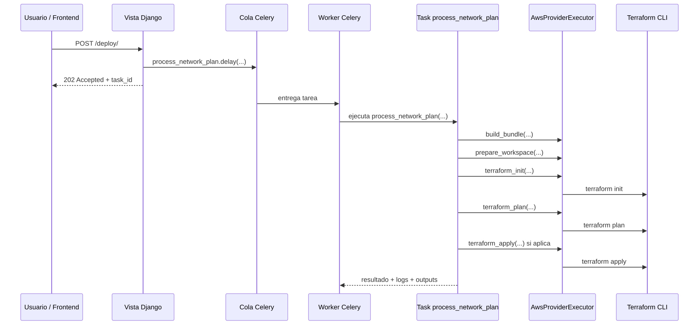

# Roadmap Visual del Flujo Canvas -> Plan -> Deploy

Este documento resume, de forma visual y tecnica, el recorrido que hace el sistema desde que llega un canvas al backend hasta que una ejecucion termina en `SUCCESS` o `FAILURE`.

## Vista general

Fuente:
- [01-canvas-plan-deploy-overview.mmd](/Users/juliocaicedo/Sites/tesis/syslab-monorepo-front-back/docs/arquitectura/assets/01-canvas-plan-deploy-overview.mmd)
- [01-canvas-plan-deploy-overview.svg](/Users/juliocaicedo/Sites/tesis/syslab-monorepo-front-back/docs/arquitectura/assets/01-canvas-plan-deploy-overview.svg)

## Capas del flujo

### 1. Capa Web

La capa web recibe requests HTTP, valida el payload, persiste `Plan` y `Lab`, y decide si debe lanzar una tarea asincrona.

#### Sync desde canvas

- Endpoint: `POST /api/network/plans/sync-from-canvas/`
- Implementacion: [apps/backend/api/views_plans.py](/Users/juliocaicedo/Sites/tesis/syslab-monorepo-front-back/apps/backend/api/views_plans.py:139)

Recorrido:

1. entra `canvas_id`, `payload`, `canvas_hash`, `canvas_updated_at`
2. se llama `_sanitize_payload_for_storage(...)`
3. se valida y compila el payload
4. se resuelve o crea el `Lab`
5. se crea o actualiza el `Plan`
6. el plan queda en `PENDING` si hubo cambios

#### Deploy de un plan

- Endpoint: `POST /api/network/plans/<plan_id>/deploy/`
- Implementacion: [apps/backend/api/views.py](/Users/juliocaicedo/Sites/tesis/syslab-monorepo-front-back/apps/backend/api/views.py:344)

Checks principales:

1. visibilidad del plan
2. si ya esta `RUNNING`
3. permisos de ejecucion real
4. consistencia de cuenta cloud
5. reconciliacion de drift
6. disponibilidad de runtime/credenciales
7. revalidacion del payload

Si todo sale bien:

1. actualiza el `Plan`
2. crea un `PlanExecutionRecord`
3. encola `process_network_plan.delay(...)`

### 2. Capa de validacion y compilacion

Esta capa toma una entrada relativamente flexible y la convierte a un formato estricto que el runtime de AWS si puede ejecutar.

Fuente:
- [02-validacion-compilacion.mmd](/Users/juliocaicedo/Sites/tesis/syslab-monorepo-front-back/docs/arquitectura/assets/02-validacion-compilacion.mmd)
- [02-validacion-compilacion.svg](/Users/juliocaicedo/Sites/tesis/syslab-monorepo-front-back/docs/arquitectura/assets/02-validacion-compilacion.svg)

#### Que significa "compilar el payload"

No significa ejecutar Terraform. Significa:

1. tomar el payload del canvas
2. normalizarlo a una intencion comun
3. traducirlo al formato AWS esperado
4. validar que la estructura final sea correcta

#### Entrada flexible

El sistema acepta dos familias de entrada:

- formato neutral con `topology`
- formato legacy estilo AWS con `vlan`, `vpcs`, `links`, `routers`

Archivo clave:
- [apps/backend/api/domain/network_intent.py](/Users/juliocaicedo/Sites/tesis/syslab-monorepo-front-back/apps/backend/api/domain/network_intent.py:189)

#### Salida estricta

El resultado final para AWS se valida con `MultiPlanSerializer`.

Archivo clave:
- [apps/backend/api/serializers.py](/Users/juliocaicedo/Sites/tesis/syslab-monorepo-front-back/apps/backend/api/serializers.py:1065)

Estructura esperada:

- `cloud`
- `vpcs`
- `subnets`
- `links`
- `routers`

### 3. Capa de permisos y contexto cloud

Antes de cualquier ejecucion real, el backend decide:

1. si el usuario puede ejecutar
2. con que cuenta cloud se ejecutaria
3. si esa cuenta coincide con la del ultimo `apply` real

Archivos clave:

- [apps/backend/api/permissions.py](/Users/juliocaicedo/Sites/tesis/syslab-monorepo-front-back/apps/backend/api/permissions.py:131)
- [apps/backend/api/cloud_connections.py](/Users/juliocaicedo/Sites/tesis/syslab-monorepo-front-back/apps/backend/api/cloud_connections.py:94)
- [apps/backend/api/serializers.py](/Users/juliocaicedo/Sites/tesis/syslab-monorepo-front-back/apps/backend/api/serializers.py:632)

Resolucion de cuenta cloud:

1. conexion explicita del lab
2. cuenta personal del owner
3. cuenta compartida del curso

### 4. Capa Celery

Celery no sabe Terraform por si mismo. Celery ejecuta una tarea Python en background, y esa tarea Python llama las funciones que terminan lanzando los comandos Terraform.

Fuente:
- [03-celery-sequence.mmd](/Users/juliocaicedo/Sites/tesis/syslab-monorepo-front-back/docs/arquitectura/assets/03-celery-sequence.mmd)
- [03-celery-sequence.svg](/Users/juliocaicedo/Sites/tesis/syslab-monorepo-front-back/docs/arquitectura/assets/03-celery-sequence.svg)

Cadena real para `terraform init`:

1. `deploy_plan(...)`
2. `process_network_plan.delay(...)`
3. Celery encola la tarea
4. un worker toma la tarea
5. se ejecuta `process_network_plan(...)`
6. se llama `executor.terraform_init(bundle)`
7. eso termina en `terraform_init(workdir, env)`
8. finalmente se ejecuta `subprocess.run(["terraform", "init", "-input=false", "-no-color"])`

Archivos clave:

- [apps/backend/api/tasks.py](/Users/juliocaicedo/Sites/tesis/syslab-monorepo-front-back/apps/backend/api/tasks.py:130)
- [apps/backend/api/providers/aws/executor.py](/Users/juliocaicedo/Sites/tesis/syslab-monorepo-front-back/apps/backend/api/providers/aws/executor.py:141)
- [apps/backend/api/providers/aws/terraform.py](/Users/juliocaicedo/Sites/tesis/syslab-monorepo-front-back/apps/backend/api/providers/aws/terraform.py:112)

### 5. Capa Terraform

En esta capa ya se ejecutan binarios reales del sistema operativo.

Archivo clave:
- [apps/backend/api/providers/aws/terraform.py](/Users/juliocaicedo/Sites/tesis/syslab-monorepo-front-back/apps/backend/api/providers/aws/terraform.py:39)

Funciones importantes:

- `render_workspace(...)`
- `terraform_init(...)`
- `terraform_plan(...)`
- `terraform_apply(...)`
- `terraform_destroy(...)`

Responsabilidades:

1. crear workdir temporal
2. renderizar `main.tf`
3. preparar backend local del state
4. ejecutar comandos Terraform con `subprocess.run(...)`

### 6. Persistencia y auditoria

Los dos modelos centrales de la ejecucion son:

- `Plan`: estado operativo actual
- `PlanExecutionRecord`: historial auditado de ejecuciones

Archivo clave:
- [apps/backend/api/models.py](/Users/juliocaicedo/Sites/tesis/syslab-monorepo-front-back/apps/backend/api/models.py:377)

Campos importantes en `Plan`:

- `status`
- `task_id`
- `payload`
- `canvas_id`
- `applied`
- `last_action`
- `outputs`
- `last_log`
- `last_apply_context`

### 7. Reconciliacion de planes en RUNNING

La funcion `_reconcile_running_plan(plan)` no ejecuta Terraform. Solo compara el estado persistido del plan con el estado real de la tarea en Celery.

Archivo clave:
- [apps/backend/api/views_plans.py](/Users/juliocaicedo/Sites/tesis/syslab-monorepo-front-back/apps/backend/api/views_plans.py:24)

Que hace:

1. si la tarea quedo demasiado tiempo en `PENDING`, marca `FAILURE`
2. si la tarea termino en `FAILURE` o `REVOKED`, propaga el error al plan
3. si la tarea termino bien, marca `SUCCESS`
4. si la ultima accion era `DESTROY`, deja `applied = False`

## Tabla corta de funciones clave

| Funcion | Capa | Que hace |
| --- | --- | --- |
| `sync_from_canvas(...)` | Web | sincroniza el canvas con un `Plan` |
| `_sanitize_payload_for_storage(...)` | Validacion | limpia aliases y fija `canvas_id` canonico |
| `validate_network_plan(...)` | Validacion | valida y compila el payload |
| `normalize_network_intent(...)` | Dominio | convierte la entrada a una intencion comun |
| `AwsProviderAdapter.compile(...)` | Provider adapter | traduce al formato AWS final |
| `deploy_plan(...)` | Web | prepara y encola la ejecucion |
| `can_execute_plan(...)` | Permisos | decide si el usuario puede hacer apply real |
| `serialize_cloud_target_state(...)` | Cloud guardrail | evita ejecutar contra otra cuenta cloud |
| `process_network_plan(...)` | Celery | ejecuta el flujo async principal |
| `AwsProviderExecutor.build_bundle(...)` | Executor | arma el contexto de ejecucion |
| `terraform_init(...)` | Terraform | ejecuta `terraform init` |
| `mark_success(...)` / `mark_failure(...)` | Persistencia | guarda el resultado final |

## Lectura recomendada del codigo

Si quieres seguir el flujo completo desde cero, este es el orden mas util:

1. [apps/backend/api/views_plans.py](/Users/juliocaicedo/Sites/tesis/syslab-monorepo-front-back/apps/backend/api/views_plans.py:139)
2. [apps/backend/api/validators.py](/Users/juliocaicedo/Sites/tesis/syslab-monorepo-front-back/apps/backend/api/validators.py:8)
3. [apps/backend/api/domain/network_intent.py](/Users/juliocaicedo/Sites/tesis/syslab-monorepo-front-back/apps/backend/api/domain/network_intent.py:189)
4. [apps/backend/api/providers/aws/adapter.py](/Users/juliocaicedo/Sites/tesis/syslab-monorepo-front-back/apps/backend/api/providers/aws/adapter.py:184)
5. [apps/backend/api/views.py](/Users/juliocaicedo/Sites/tesis/syslab-monorepo-front-back/apps/backend/api/views.py:344)
6. [apps/backend/api/permissions.py](/Users/juliocaicedo/Sites/tesis/syslab-monorepo-front-back/apps/backend/api/permissions.py:131)
7. [apps/backend/api/cloud_connections.py](/Users/juliocaicedo/Sites/tesis/syslab-monorepo-front-back/apps/backend/api/cloud_connections.py:94)
8. [apps/backend/api/tasks.py](/Users/juliocaicedo/Sites/tesis/syslab-monorepo-front-back/apps/backend/api/tasks.py:130)
9. [apps/backend/api/providers/aws/executor.py](/Users/juliocaicedo/Sites/tesis/syslab-monorepo-front-back/apps/backend/api/providers/aws/executor.py:42)
10. [apps/backend/api/providers/aws/terraform.py](/Users/juliocaicedo/Sites/tesis/syslab-monorepo-front-back/apps/backend/api/providers/aws/terraform.py:72)
