# Graficas de Casos de Uso - SysLab

Este documento contiene las graficas de los casos de uso del MVP en formato Mermaid, derivadas del documento [Casos de Uso del Proyecto SysLab](/Users/juliocaicedo/Sites/tesis/syslab-monorepo-front-back/docs/casos-de-uso-mvp.md).

## Criterios de rediseño

Estos diagramas fueron replanteados tomando como referencia el artículo de ArchiMetric "10 consejos para crear un diagrama de casos de uso profesional":
- priorizar objetivos del usuario por sobre funciones técnicas aisladas
- usar nombres cortos y legibles
- representar actores como roles
- usar `<<include>>` para comportamientos comunes
- usar `<<extend>>` para comportamientos excepcionales o condicionales
- reducir la cantidad de casos por vista y ordenar mejor la composición visual

Referencia:
- https://www.archimetric.com/es/10_tips_to_create_professional_use_case_diagram/

## 1. Vista general del sistema

Fuente Mermaid:
- [01-vista-general.mmd](/Users/juliocaicedo/Sites/tesis/syslab-monorepo-front-back/docs/assets/casos-de-uso/01-vista-general.mmd)
- [01-vista-general.png](/Users/juliocaicedo/Sites/tesis/syslab-monorepo-front-back/docs/assets/casos-de-uso/01-vista-general.png)

## 2. Casos de uso del estudiante

Fuente Mermaid:
- [02-estudiante.mmd](/Users/juliocaicedo/Sites/tesis/syslab-monorepo-front-back/docs/assets/casos-de-uso/02-estudiante.mmd)
- [02-estudiante.png](/Users/juliocaicedo/Sites/tesis/syslab-monorepo-front-back/docs/assets/casos-de-uso/02-estudiante.png)

## 3. Casos de uso del docente

Fuente Mermaid:
- [03-docente.mmd](/Users/juliocaicedo/Sites/tesis/syslab-monorepo-front-back/docs/assets/casos-de-uso/03-docente.mmd)
- [03-docente.png](/Users/juliocaicedo/Sites/tesis/syslab-monorepo-front-back/docs/assets/casos-de-uso/03-docente.png)

## 4. Casos de uso del platform admin

Fuente Mermaid:
- [04-platform-admin.mmd](/Users/juliocaicedo/Sites/tesis/syslab-monorepo-front-back/docs/assets/casos-de-uso/04-platform-admin.mmd)
- [04-platform-admin.png](/Users/juliocaicedo/Sites/tesis/syslab-monorepo-front-back/docs/assets/casos-de-uso/04-platform-admin.png)

## 5. Gobierno de ejecucion cloud

Fuente Mermaid:
- [05-flujo-cloud.mmd](/Users/juliocaicedo/Sites/tesis/syslab-monorepo-front-back/docs/assets/casos-de-uso/05-flujo-cloud.mmd)
- [05-flujo-cloud.png](/Users/juliocaicedo/Sites/tesis/syslab-monorepo-front-back/docs/assets/casos-de-uso/05-flujo-cloud.png)

## Notas

- Las graficas estan pensadas para documentacion y defensa de tesis.
- Los diagramas priorizan metas observables del usuario. Casos de soporte como login, registro o perfil pueden quedar en la especificacion textual sin saturar la vista principal.
- Mermaid no implementa UML de casos de uso puro en todos los renderizadores, por eso estas vistas usan `flowchart` con convencion visual de caso de uso.
- Si quieres, el siguiente paso puede ser generar una version mas formal en:
  - `PlantUML`
  - `draw.io`
  - `PNG`
  - `SVG`
