# Graficas de Casos de Uso - SysLab

Este documento contiene las graficas vigentes de los casos de uso del MVP en formato Mermaid, derivadas de [Casos de uso del proyecto SysLab](./casos-de-uso-mvp.md).

## 1. Vista general del sistema

Fuente Mermaid:
- [01-vista-general.mmd](./assets/casos-de-uso/01-vista-general.mmd)
- [01-vista-general.png](./assets/casos-de-uso/01-vista-general.png)

## 2. Casos de uso del estudiante

Fuente Mermaid:
- [02-estudiante.mmd](./assets/casos-de-uso/02-estudiante.mmd)
- [02-estudiante.png](./assets/casos-de-uso/02-estudiante.png)

## 3. Casos de uso del docente

Fuente Mermaid:
- [03-docente.mmd](./assets/casos-de-uso/03-docente.mmd)
- [03-docente.png](./assets/casos-de-uso/03-docente.png)

## 4. Casos de uso del platform admin

Fuente Mermaid:
- [04-platform-admin.mmd](./assets/casos-de-uso/04-platform-admin.mmd)
- [04-platform-admin.png](./assets/casos-de-uso/04-platform-admin.png)

## 5. Gobierno de ejecucion cloud

Fuente Mermaid:
- [05-flujo-cloud.mmd](./assets/casos-de-uso/05-flujo-cloud.mmd)
- [05-flujo-cloud.png](./assets/casos-de-uso/05-flujo-cloud.png)

## Notas

- Las graficas estan pensadas para documentacion y defensa de tesis.
- Los diagramas priorizan metas observables del usuario. Casos de soporte como login, registro o perfil pueden quedar en la especificacion textual sin saturar la vista principal.
- Mermaid no implementa UML de casos de uso puro en todos los renderizadores, por eso estas vistas usan `flowchart` con convencion visual de caso de uso.
