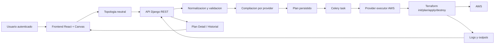
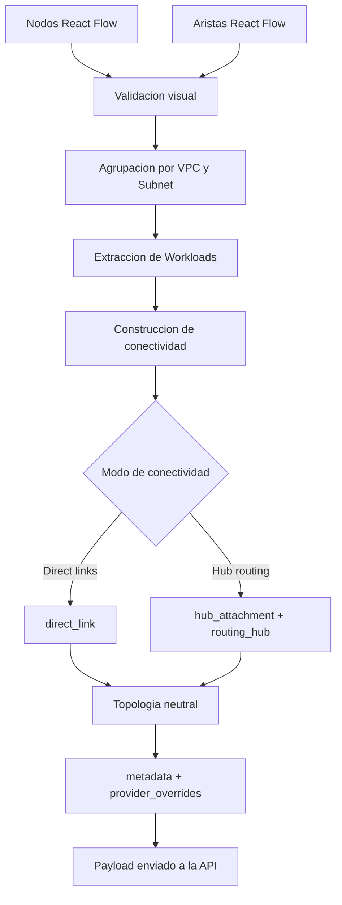
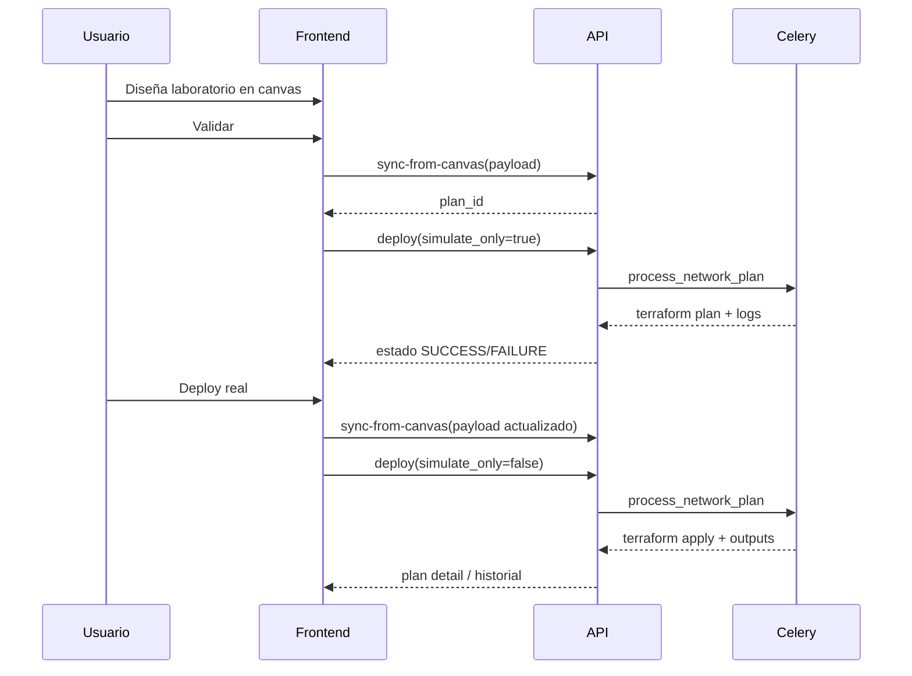
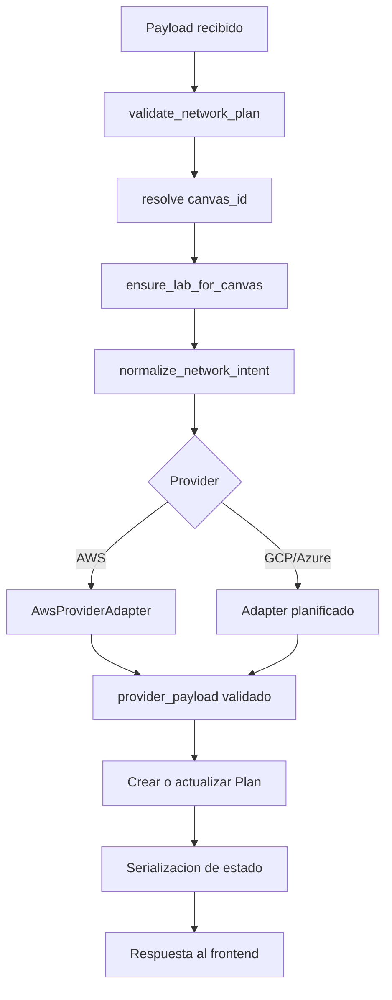
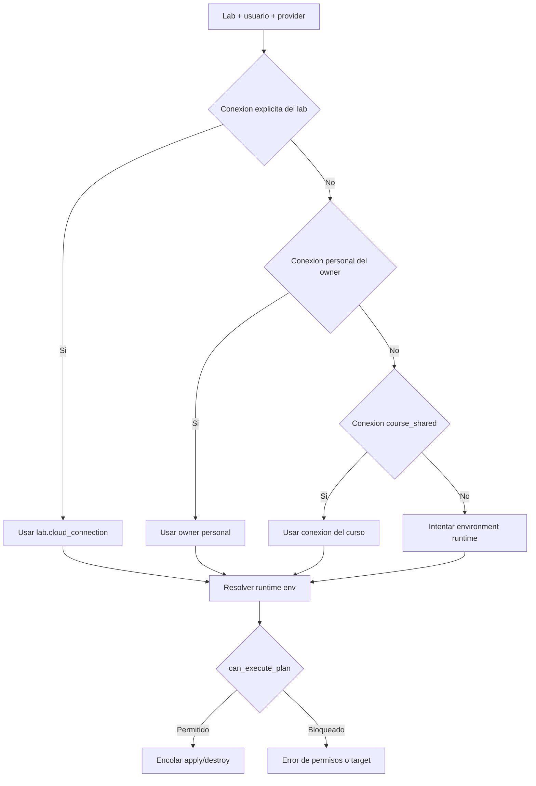
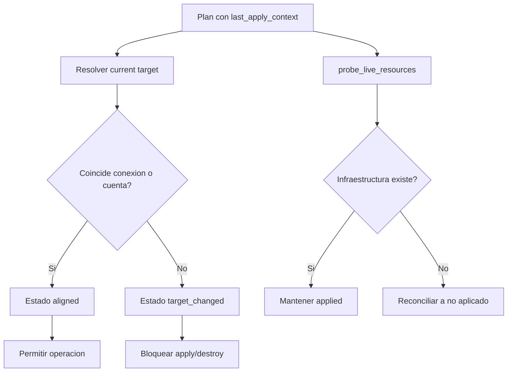

# 3.6 Detalles de implementación

Esta sección describe la implementación real del sistema a partir del código disponible en el monorepo. A diferencia de una descripción puramente conceptual, aquí se explica cómo los componentes del `frontend`, la `API`, la capa de ejecución asíncrona y el módulo de gestión cloud se articulan para permitir la creación de laboratorios, el modelado visual de topologías, la validación de planes, la ejecución de Terraform y la trazabilidad de las operaciones realizadas.

La implementación sigue un enfoque modular. Cada módulo resuelve una responsabilidad específica, pero todos comparten una misma secuencia operativa: el usuario diseña una topología en el canvas, el frontend la transforma en una representación neutral, el backend valida y compila esa intención hacia un payload ejecutable por provider, y finalmente una tarea asíncrona prepara y ejecuta Terraform. En paralelo, el sistema mantiene reglas de permisos, resolución de credenciales, auditoría y control de consistencia entre el laboratorio lógico y la cuenta cloud efectiva.

En el estado actual del proyecto, la arquitectura ya fue preparada para soportar múltiples providers, pero el único provider con ejecución real completa es `AWS`. `GCP` y `Azure` existen como extensión planificada a nivel de contratos, adapters y placeholders de runtime, lo que permite que la tesis describa una arquitectura extensible sin afirmar erróneamente que el despliegue real ya es multi-cloud.

La Figura 3.23 resume el flujo de extremo a extremo implementado actualmente.

**Figura 3.23.** Flujo general de interacción entre frontend, API, ejecución asíncrona y proveedor cloud.

## 3.6.1 Módulo de front-end

El módulo de front-end fue desarrollado con `React 18` y `Vite`, utilizando `Material UI` para la interfaz, `React Router` para la navegación, `Zustand` para estado local del canvas y `React Hook Form` con `Yup` para los formularios. Su función principal es permitir que el usuario interactúe con la plataforma, administre laboratorios y construya topologías de red sin escribir infraestructura como código de forma directa.

Los archivos principales de este módulo se concentran en `apps/frontend/src/features/networkCanvas`, `apps/frontend/src/features/plans`, `apps/frontend/src/features/settings` y `apps/frontend/src/infrastructure/http/api.js`. Desde estas áreas se implementan los siguientes flujos:

- autenticación de usuarios y persistencia del token de API
- creación y edición de laboratorios
- gestión de conexiones cloud, AMIs y key pairs
- modelado visual de topologías en el canvas
- validación previa del plan
- lanzamiento de `preview`, `apply` y `destroy`
- consulta del historial y del detalle de cada plan

### Construcción visual de la topología

El núcleo del modelado visual se encuentra en el canvas implementado con `@xyflow/react`. En esta vista, los elementos de red se representan mediante nodos y aristas. Los nodos principales del modelo actual son:

- `Network Segment`, equivalente lógico a una VPC
- `Zone`, equivalente lógico a una subnet
- `Workload`, equivalente lógico a una instancia de cómputo
- `Connectivity Policy`, utilizada para definir conectividad entre segmentos

Cada nodo almacena tanto información visual como información de configuración. Por ejemplo, un `Workload` puede incluir el nombre de la instancia, tipo de máquina, imagen, dirección IP privada, key pair y banderas específicas del provider. Esta separación permite que el canvas conserve una experiencia gráfica amigable, pero sin perder la semántica necesaria para generar infraestructura real.

### Transformación del canvas a topología neutral

Una de las decisiones más relevantes de implementación fue separar la representación gráfica del canvas de la representación lógica que consume el backend. El flujo de transformación está centralizado en `apps/frontend/src/features/networkCanvas/core/useDeployNetwork.js`.

Cuando el usuario desea validar o desplegar un laboratorio, el frontend:

1. valida la topología visual para detectar errores de modelado
2. agrupa subredes por segmento e instancias por subred
3. construye la conectividad entre segmentos a partir de las aristas del canvas
4. decide si la conectividad corresponde a `direct links` o a un `hub routing`
5. genera una topología neutral compuesta por `network`, `segments` y `connectivity`
6. adjunta `provider_overrides` para conservar detalles específicos de AWS o GCP

Este diseño es importante porque evita que el backend dependa directamente de la estructura interna de React Flow. En lugar de enviar nodos y aristas crudos, el frontend envía una intención de infraestructura expresada con conceptos más estables y portables. El payload resultante incluye:

- `target_provider`
- `canvas_id`
- `metadata`
- `topology`

Dentro de `topology`, el bloque `network` describe el laboratorio como unidad global, `segments` representa las redes principales del escenario, y `connectivity` modela enlaces directos o adjuntos hacia un hub de ruteo. En el caso de AWS, esta conectividad se compila posteriormente como `VPC Peering` o `Transit Gateway`.

La Figura 3.24 ejemplifica cómo el frontend transforma la representación del canvas en una estructura neutral consumible por el backend.

**Figura 3.24.** Transformación del canvas visual hacia la topología neutral y el payload final enviado al backend.

### Validación, sincronización y despliegue

El frontend no envía directamente un `terraform apply`. Antes de eso, ejecuta un flujo intermedio más controlado:

1. sincroniza el plan desde el canvas con `POST /api/network/plans/sync-from-canvas/`
2. guarda el `plan_id` en el laboratorio asociado
3. lanza un `deploy` en modo `simulate_only=true`, equivalente a un `terraform plan`
4. consulta el estado del plan hasta completar la validación
5. interpreta los logs y resume el impacto esperado del cambio

Solo después de una validación exitosa el usuario puede ejecutar un `apply` real. Antes de eso, el sistema vuelve a sincronizar el canvas con el backend para asegurar que el payload desplegado corresponda al estado más reciente del laboratorio.

Este comportamiento introduce tres ventajas de implementación:

- reduce el riesgo de desplegar una topología desactualizada
- separa el concepto de validación del concepto de ejecución real
- permite reutilizar un mismo `Plan` como objeto persistente que evoluciona junto con el canvas

La Figura 3.25 muestra la secuencia real que sigue el frontend desde la validación hasta el despliegue definitivo.

**Figura 3.25.** Secuencia de validación previa y `apply` real controlado desde el frontend.

### Estado de la interfaz y experiencia de operación

El frontend incorpora además una pequeña máquina de estados para representar el ciclo de vida del plan. Entre los estados visibles se distinguen `IDLE`, `SYNCING`, `PLANNING`, `SUCCESS` y `ERROR`, así como estados funcionales derivados como `PLAN_VALIDATED`, `PLAN_OUTDATED` o `ACTIVE`. Esto se refleja en componentes como `PacketToolbar`, `ConfirmDeployDialog` y `PlanDetailPage`, los cuales informan al usuario si el laboratorio ya fue validado, si existe infraestructura activa o si el canvas fue modificado después del último despliegue.

Desde el punto de vista de desarrollo, esta capa de estado es importante porque desacopla la experiencia de usuario de la implementación interna de Terraform. El usuario trabaja sobre conceptos comprensibles como validar, desplegar, redeplegar o destruir, mientras que la lógica de API y de ejecución asíncrona queda encapsulada tras acciones de alto nivel.

## 3.6.2 Módulo API

El módulo API fue desarrollado con `Django` y `Django REST Framework`, y constituye la capa central de coordinación del sistema. Su responsabilidad no se limita a operaciones CRUD, sino que actúa como intérprete entre la topología neutral construida por el frontend y el payload específico que será consumido por el provider cloud.

Los puntos de entrada principales se encuentran en:

- `apps/backend/api/urls.py`
- `apps/backend/api/views.py`
- `apps/backend/api/views_plans.py`
- `apps/backend/api/serializers.py`
- `apps/backend/api/validators.py`
- `apps/backend/api/domain/network_intent.py`

### Modelo de datos principal

La implementación actual persiste varios conceptos que estructuran el dominio:

- `User` y `UserProfile`, para rol, estado, curso y configuración del usuario
- `Course`, para organizar estudiantes y docentes
- `Lab`, como espacio persistente de trabajo y contexto del laboratorio
- `Plan`, como unidad operativa desplegable asociada al canvas
- `CloudConnection`, para definir la identidad cloud utilizada por Terraform
- `CloudExecutionDelegation`, para habilitar ejecuciones delegadas
- `PlanExecutionRecord`, para registrar el historial auditado de cada operación

En términos de diseño, la diferencia entre `Lab` y `Plan` es esencial. El `Lab` representa el laboratorio como objeto funcional y pedagógico, mientras que el `Plan` representa el estado técnico de la infraestructura asociada a ese laboratorio. Esto permite mantener un mismo laboratorio aunque el usuario valide, aplique, redepliegue o destruya varias veces su infraestructura.

### Validación y normalización del payload

El backend admite dos formatos de entrada:

- un formato neutral basado en `topology`
- un formato legacy con estructura orientada directamente a AWS

Para resolver esta convivencia, la API incorpora una etapa de normalización en `network_intent.py`. La función `normalize_network_intent` transforma el payload entrante a una intención canónica compuesta por:

- `target_provider`
- `metadata`
- `topology`
- `capabilities`
- `provider_overrides`
- `legacy_payload`

Esto permite desacoplar el resto del backend de variaciones en el formato enviado por el frontend. Desde este punto en adelante, la lógica interna trabaja con una representación estable del laboratorio, incluso si el origen fue un payload antiguo.

La Figura 3.26 sintetiza el flujo de procesamiento del plan dentro de la API, reemplazando la imagen pendiente del borrador original.

**Figura 3.26.** Flujo interno de validación, normalización, compilación y persistencia del plan en la API.

### Sincronización entre canvas y plan

La sincronización entre el canvas y el backend se implementa en `PlanViewSet.sync_from_canvas` y en `network_plan_create`. Durante esta etapa la API:

1. valida el payload recibido
2. resuelve el `canvas_id` canónico
3. asegura la existencia del `Lab` asociado
4. crea o actualiza el `Plan` visible de ese canvas
5. marca el plan como `PENDING` si hubo cambios en el contenido o en el hash del canvas

Este mecanismo evita crear múltiples planes duplicados para un mismo laboratorio. En cambio, el sistema mantiene una relación estable entre `canvas_id` y `Plan`, con lo cual el usuario puede seguir evolucionando un mismo laboratorio sin perder su historial operativo.

### Compilación provider-aware

Una vez normalizada la intención, la API delega la compilación a un adapter específico del provider. En el caso de AWS, esta lógica vive en `apps/backend/api/providers/aws/adapter.py`. El adapter:

- recorre `segments`, `zones` y `workloads`
- recupera detalles específicos desde `provider_overrides`
- recompone la estructura `vpcs`, `subnets`, `instances`, `links` y `routers`
- valida el resultado final mediante `MultiPlanSerializer`

El aspecto más importante de esta capa es que el backend ya no genera infraestructura acoplándose directamente a AWS desde el primer paso. Primero trabaja con una intención neutral, y luego cada adapter decide cómo traducirla a su provider. Este patrón mejora la mantenibilidad del sistema y reduce el costo de incorporar nuevos providers en el futuro.

### Exposición de estado para el frontend

La API también es responsable de entregar al frontend una visión rica del estado del plan. A través de `PlanListSerializer` y `PlanDetailSerializer`, cada plan expone:

- estado actual (`PENDING`, `RUNNING`, `SUCCESS`, `FAILURE`)
- si existe infraestructura aplicada (`applied`)
- última acción ejecutada (`plan`, `apply`, `destroy`, `canvas_update`)
- capacidad efectiva de `apply` y `destroy`
- logs, outputs y payload persistido
- contexto del último `apply` real
- historial de ejecuciones
- estado de reconciliación del objetivo cloud actual

Con esto, el frontend puede construir interfaces como `Plan Detail` sin tener que inferir reglas complejas por sí mismo. La API actúa como fuente de verdad tanto del estado operativo como del contexto de permisos y auditoría.

## 3.6.3 Módulo de ejecución asíncrona y aprovisionamiento

El módulo de ejecución asíncrona y aprovisionamiento procesa las operaciones pesadas de infraestructura fuera del ciclo de respuesta HTTP. Esta separación era necesaria porque un `terraform plan`, `terraform apply` o `terraform destroy` puede tardar desde varios segundos hasta varios minutos, y además requiere acceso controlado a credenciales, archivos temporales y logs de larga duración.

La implementación se concentra principalmente en:

- `apps/backend/api/tasks.py`
- `apps/backend/api/providers/execution_base.py`
- `apps/backend/api/providers/aws/executor.py`
- `apps/backend/api/providers/aws/terraform.py`
- `apps/backend/provisioning/templates/main.tf.j2`

### Ejecución asíncrona con Celery

Las operaciones reales se ejecutan mediante tareas `Celery`. Las dos tareas principales son:

- `process_network_plan`, para `plan` y `apply`
- `destroy_last_deploy`, para `destroy`

Cuando la API recibe una solicitud de despliegue o destrucción, no ejecuta Terraform directamente. En su lugar:

1. valida si la operación está permitida
2. actualiza el estado del `Plan`
3. crea un `PlanExecutionRecord`
4. encola la tarea Celery correspondiente
5. responde inmediatamente al cliente con el `task_id`

Este patrón mejora la escalabilidad y evita que la interfaz quede bloqueada esperando una operación de infraestructura.

### Bundles de ejecución y separación por provider

La ejecución no está implementada como un bloque monolítico. Cada provider construye un `ProviderExecutionBundle` que encapsula:

- `payload` normalizado
- modo `simulate_only`
- variables de entorno efectivas
- diagnósticos de credenciales
- directorio temporal de trabajo
- ruta del `terraform.tfstate`
- texto generado del `main.tf`
- log unificado de la operación

Sobre este bundle opera un `ProviderExecutor`. En AWS, el executor se encarga de:

- normalizar el payload de entrada
- preparar el workspace temporal
- generar archivos de depuración
- ejecutar `terraform init`, `plan`, `apply` o `destroy`
- leer `outputs`
- limpiar residuos de infraestructura tras el `destroy`
- eliminar el directorio temporal al finalizar

Esta separación vuelve más claro el ciclo de vida de una ejecución y facilita que otros providers implementen el mismo contrato sin reescribir el flujo general de Celery.

### Generación de Terraform

La infraestructura del laboratorio no se guarda como archivos Terraform estáticos dentro del repositorio. En su lugar, el sistema genera dinámicamente un workspace por ejecución. La función `render_workspace` crea:

- un directorio temporal
- un archivo `backend.tf` con backend local
- un archivo `main.tf` renderizado desde `main.tf.j2`
- un directorio de estado persistido en `/tfstate/<plan_id>/terraform.tfstate`

El archivo `main.tf.j2` define la traducción final a infraestructura AWS e incluye recursos como:

- VPCs
- subnets públicas y privadas
- route tables
- internet gateways
- NAT gateways
- instancias EC2
- VPC peering
- Transit Gateway y sus attachments

Esto permite que una misma plantilla soporte varios escenarios de laboratorio sin necesidad de mantener un archivo Terraform distinto por caso.

La Figura 3.27 resume el ciclo de ejecución asíncrona implementado para `plan`, `apply` y `destroy`.

```mermaid
flowchart LR
    A[Request HTTP] --> B[Validacion de permisos]
    B --> C[Plan status RUNNING]
    C --> D[PlanExecutionRecord PENDING]
    D --> E[Celery queue]
    E --> F[ProviderExecutionBundle]
    F --> G[Workspace temporal]
    G --> H[terraform init]
    H --> I[terraform plan]
    I --> J{simulate_only}
    J -->|Si| M[Persistir logs]
    J -->|No| K[Preflight AWS]
    K --> L[terraform apply o destroy]
    L --> N[Leer outputs]
    N --> O[Actualizar Plan y auditoria]
    M --> O
```

**Figura 3.27.** Flujo de ejecución asíncrona y aprovisionamiento desde la cola hasta la persistencia del resultado.

### Preflight y control de errores

Antes de ejecutar un `apply` real, el executor de AWS ejecuta comprobaciones de preflight para bloquear fallos previsibles. Entre ellas se encuentran:

- validación de existencia de `key pairs`
- verificación de cuota para `Transit Gateway`

Además, la capa Terraform interpreta ciertos errores frecuentes y los transforma en mensajes más útiles para el usuario. Por ejemplo, si AWS devuelve `InvalidKeyPair.NotFound` o `TransitGatewayLimitExceeded`, el backend responde con mensajes específicos que explican el problema y orientan el siguiente paso.

### Persistencia incremental de logs y outputs

Durante la ejecución, el backend no espera al final para guardar toda la información. El log unificado se va persistiendo incrementalmente en la base de datos mediante un flusher que actualiza `last_log` y `last_log_updated_at`. De esta forma, el frontend puede consultar el progreso del plan mientras la tarea sigue en curso.

Tras un `apply` exitoso, el sistema intenta leer `terraform output -json` y simplifica el resultado para almacenarlo en `Plan.outputs`. Estos outputs sirven luego para:

- mostrar información útil al usuario
- alimentar pruebas post-despliegue
- realizar reconciliación de drift
- conservar evidencia técnica del último estado activo

### Destroy controlado y limpieza posterior

La destrucción de infraestructura se maneja como una operación explícita y controlada. Si el plan nunca fue aplicado realmente, el sistema responde con un `no-op` y evita intentar destruir recursos inexistentes. Cuando sí existe infraestructura activa, la tarea de `destroy`:

- reconstruye el workspace desde el payload persistido
- ejecuta `terraform destroy`
- conserva los últimos `outputs` por razones de auditoría
- intenta limpiar `NAT Gateways` residuales si Terraform no los removió completamente

Esta decisión es relevante porque evita que el estado histórico del plan desaparezca después de destruir la infraestructura. El sistema conserva suficiente contexto para explicar qué existió, con qué cuenta se creó y cuándo fue eliminado.

## 3.6.4 Módulo de gestión cloud y trazabilidad

El módulo de gestión cloud no solo administra credenciales. También resuelve qué identidad puede ejecutar cada laboratorio, bajo qué reglas de permisos, con qué nivel de trazabilidad y cómo se detectan inconsistencias entre la cuenta actual y la cuenta usada en ejecuciones previas.

Los archivos principales de este módulo incluyen:

- `apps/backend/api/models.py`
- `apps/backend/api/cloud_connections.py`
- `apps/backend/api/permissions.py`
- `apps/backend/api/providers/runtime_registry.py`
- `apps/backend/api/providers/connection_registry.py`

### Conexiones cloud y resolución de credenciales

El modelo `CloudConnection` encapsula la configuración de acceso al provider. En el estado actual del MVP, las conexiones ejecutables reales están implementadas para AWS con dos modos de autenticación:

- `aws_static_keys`
- `aws_assume_role`

Además, cada conexión puede tener alcance:

- `personal`, asociada al usuario propietario
- `course_shared`, compartida a nivel de curso

La resolución efectiva de la conexión no depende únicamente de que el laboratorio tenga una conexión explícita seleccionada. Si no existe una asociación directa, el backend intenta resolver automáticamente:

1. una conexión explícita del laboratorio
2. una conexión personal activa del dueño del laboratorio
3. una conexión compartida activa del curso

Esto permite que el sistema opere con menos configuración manual y que el laboratorio mantenga continuidad incluso si el usuario no vuelve a seleccionar una conexión en cada edición.

### Runtime registry y arquitectura extensible por provider

Una mejora importante respecto de versiones más acopladas del sistema es la incorporación de un `runtime_registry` y un `connection_registry`. Esta capa define, por provider:

- cómo construir variables de entorno de runtime
- cómo inspeccionar la identidad efectiva
- cómo probar una conexión
- si la ejecución real está permitida
- cómo verificar recursos desplegados para reconciliar drift
- qué reglas de validación tiene cada tipo de conexión

En consecuencia, el sistema ya no llama helpers de AWS de manera rígida desde todas las vistas y tareas. En cambio, resuelve el comportamiento adecuado a través de contratos por provider. Esto prepara la arquitectura para crecimiento futuro y al mismo tiempo mantiene explícito que hoy `AWS` es el único provider listo para ejecución real.

La Figura 3.28 muestra cómo el backend resuelve la conexión cloud y decide si una ejecución real puede avanzar.

**Figura 3.28.** Resolución de conexión cloud efectiva y decisión de autorización para ejecución real.

### Reglas de permisos y delegación

La gestión cloud está estrechamente acoplada a las reglas de autorización del sistema. No basta con ver o editar un laboratorio para poder desplegarlo. La operación real está regulada por `can_execute_plan` y por la resolución de la conexión efectiva.

En la implementación actual:

- `platform_admin` puede ejecutar cualquier plan
- el dueño del laboratorio puede ejecutar su propio plan
- un docente puede ejecutar sobre un laboratorio del curso si la conexión efectiva es `course_shared`
- un docente puede ejecutar sobre una conexión personal del estudiante solo si existe una `CloudExecutionDelegation` activa

Esta regla es importante para la tesis porque demuestra que el sistema no solo modela infraestructura, sino también gobierno de ejecución sobre recursos cloud reales.

### Auditoría de la cuenta cloud efectiva

Cada `apply` real registra un snapshot del contexto de ejecución en `last_apply_context`. Este contexto incluye, entre otros datos:

- provider usado
- fuente de credenciales
- región efectiva
- conexión cloud resuelta
- alcance de la conexión
- cuenta AWS efectiva
- `ARN` e identidad STS

Adicionalmente, cada operación crea un `PlanExecutionRecord`, que mantiene el historial auditable de:

- quién solicitó la operación
- si fue `plan`, `apply` o `destroy`
- si fue simulación o ejecución real
- qué conexión se resolvió
- si hubo delegación
- qué identidad cloud se observó
- si la operación terminó en éxito, fallo o `no-op`

Esta capa de auditoría es especialmente valiosa en contextos académicos, ya que permite demostrar trazabilidad completa sobre despliegues reales, incluso cuando participan varios actores como estudiantes, docentes y administradores.

### Reconciliación de drift y cambio de objetivo cloud

Otro aspecto avanzado de la implementación es la reconciliación entre el estado lógico del plan y el estado cloud real. El sistema contempla dos problemas:

- que la infraestructura ya no exista en AWS aunque el plan siga marcado como `applied`
- que la conexión cloud actual no coincida con la cuenta usada en el último `apply` real

Para el primer caso, el backend utiliza `probe_live_resources` para verificar si las VPCs registradas en `outputs` aún existen. Si detecta que la infraestructura desapareció, el plan se reconcilia automáticamente a estado no aplicado.

Para el segundo caso, la API calcula `cloud_target_state`. Si el laboratorio hoy resuelve otra conexión o incluso otra cuenta AWS distinta de la usada en el último despliegue real, el sistema bloquea nuevos `apply` o `destroy` hasta que la inconsistencia sea resuelta. Con ello se evita una clase de errores especialmente peligrosa: destruir o modificar infraestructura en una cuenta distinta a la que originó el estado histórico del plan.

La Figura 3.29 resume el comportamiento de reconciliación entre el estado almacenado del plan y el destino cloud actual.

**Figura 3.29.** Reconciliación de drift e inconsistencias entre la cuenta cloud actual y la usada en el último `apply` real.

### Síntesis del módulo cloud

En conjunto, el módulo de gestión cloud cumple cuatro funciones simultáneas:

- resolver credenciales de ejecución
- aplicar reglas de autorización por rol, curso y delegación
- auditar la identidad cloud real usada en cada operación
- proteger la consistencia entre el estado persistido del plan y el destino cloud efectivo

Esta combinación hace que la implementación trascienda un simple disparador de Terraform. El sistema actúa, en la práctica, como una capa de control y gobernanza para laboratorios desplegables en AWS.

## Cierre de la sección

La implementación desarrollada permite afirmar que el sistema ya funciona como una plataforma integrada de modelado, validación y despliegue de laboratorios de red sobre AWS. El frontend abstrae la complejidad de Terraform mediante un canvas visual, la API transforma esa interacción en una intención de infraestructura validable, la capa asíncrona ejecuta el aprovisionamiento real y el módulo de gestión cloud aporta permisos, control de identidad y trazabilidad.

Desde la perspectiva de desarrollo, uno de los aportes más relevantes es que la solución no quedó acoplada exclusivamente a una representación visual ni a una implementación rígida de AWS. La introducción de una topología neutral, adapters por provider, ejecutores desacoplados y registros de runtime deja una base técnica sólida para evolucionar el proyecto hacia escenarios multi-provider en trabajos posteriores, manteniendo al mismo tiempo una implementación real y comprobable para el MVP actual.
